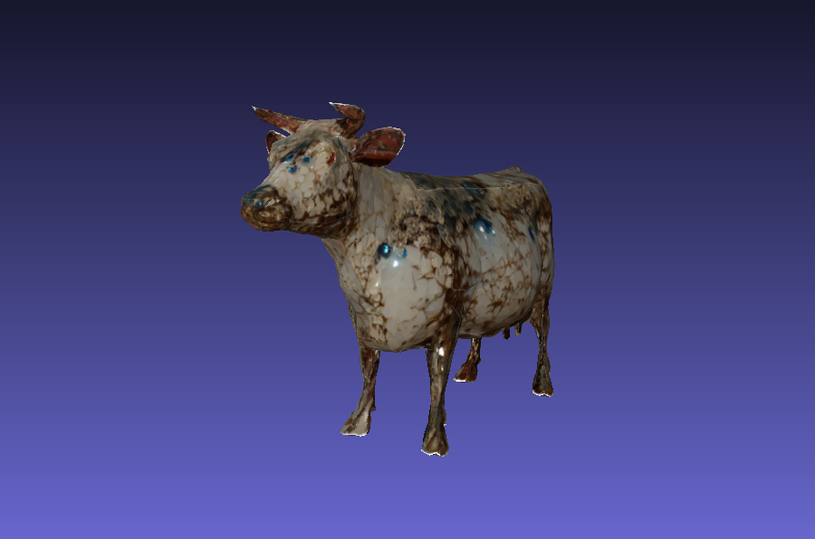
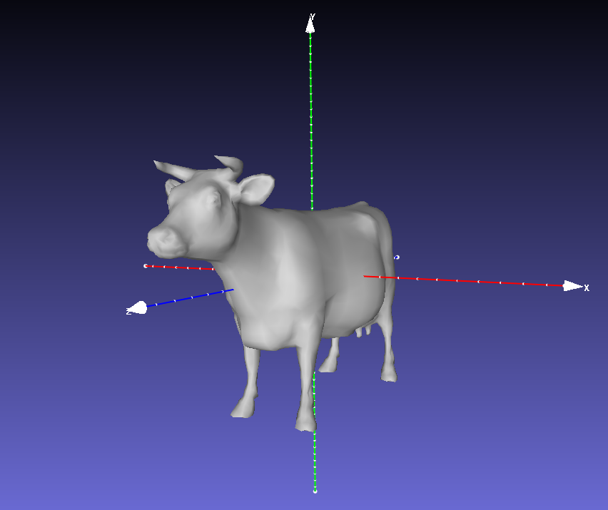

<p align="center">

  <h1 align="center"><a href="https://sairajk.github.io/easi-tex" target="_blank">EASI-Tex: Edge-Aware Mesh Texturing from Single Image</a></h1>

  <p align="center">
    <a href="https://sairajk.github.io/" target="_blank"><strong>Sai Raj Kishore Perla</strong></a>
    ·
    <a href="https://yizhiwang96.github.io/" target="_blank"><strong>Yizhi Wang</strong></a>
    ·
    <a href="https://www.sfu.ca/~amahdavi/" target="_blank"><strong>Ali Mahdavi-Amiri</strong></a>
    ·
    <a href="https://www.cs.sfu.ca/~haoz/" target="_blank"><strong>Hao (Richard) Zhang</strong></a>
    <br />
    <i>ACM Transactions on Graphics (Proceedings of SIGGRAPH), 2024</i>    
  </p>

  <p align="center">
    <a href="https://arxiv.org/abs/2405.17393" target="_blank"><strong>arXiv</strong></a>
    |
    <a href="https://sairajk.github.io/easi-tex" target="_blank"><strong>Project Page</strong></a>
  </p>

  <div  align="center">
    <a>
      
    </a>
  </div>
</p>

We present a novel approach for single-image mesh texturing, which employs a diffusion model with judicious conditioning to seamlessly transfer an object's texture from a single RGB image to a given 3D mesh object. We do not assume that the two objects belong to the same category, and even if they do, there can be significant discrepancies in their geometry and part proportions. Our method aims to rectify the discrepancies by conditioning a pre-trained Stable Diffusion generator with edges describing the mesh through ControlNet, and features extracted from the input image using IP-Adapter to generate textures that respect the underlying geometry of the mesh and the input texture without any optimization or training. We also introduce Image Inversion, a novel technique to quickly personalize the diffusion model for a single concept using a single image, for cases where the pre-trained IP-Adapter falls short in capturing all the details from the input image faithfully. Experimental results demonstrate the efficiency and effectiveness of our edge-aware single-image mesh texturing approach, coined EASI-Tex, in preserving the details of the input texture on diverse 3D objects, while respecting their geometry.

## Setup

The code is tested on Ubuntu 20.04 LTS with PyTorch 2.0.1 and CUDA 11.8. Please follow the steps below to setup the environment.

```shell
# create and activate the conda environment
conda create -n easitex python=3.10
conda activate easitex

# install PyTorch 2.0.1
conda install pytorch==2.0.1 torchvision==0.15.2 torchaudio==2.0.2 pytorch-cuda=11.8 -c pytorch -c nvidia
```

Then, install PyTorch3D:

```shell
# install runtime dependencies for PyTorch3D
conda install -c fvcore -c iopath -c conda-forge fvcore iopath
conda install -c bottler nvidiacub

# install PyTorch3D
conda install pytorch3d -c pytorch3d
```

Install `xformers` to accelerate transformers:

```shell
# please don't use pip to install it, as it only supports PyTorch>=2.0
conda install xformers -c xformers
```

Install the necessary packages listed out in requirements.txt:

```shell
pip install -r requirements.txt
```

Download the following files:
- `control_sd15_canny.pth` from [ControlNet](https://huggingface.co/lllyasviel/ControlNet/tree/main/models), and put it under `models/ControlNet/models/`.
- `control_v11p_sd15_canny.pth` from [ControlNet v1.1](https://huggingface.co/lllyasviel/ControlNet-v1-1/tree/main), and put it under `models/ControlNet/models/`.
- `image_encoder/` from [IP-Adapter](https://huggingface.co/h94/IP-Adapter/tree/main/models), and put it under `ip_adapter/`.
- `ip-adapter-plus_sd15.bin` from [IP-Adapter](https://huggingface.co/h94/IP-Adapter/tree/main/models), and put it under `ip_adapter/`.

## Usage

### Try the demo / Sanity check

To make sure everything is set up and configured correctly, you can run the following script to transfer texture from a [round bird](data/texture_images/round_bird/round_bird_4.jpg) to a [cow](data/meshes/cow/cow_fr-z_up-y.obj).

```shell
./bash/run.sh
```

Once the synthesis completes, you should be able to see the generated assets under `outputs/canny/cow-round_bird/42-ip1.0-cn1.0-dist0.8-gs10.0-p36-h20-us0.4-vt0.1`. The final textured mesh `42-ip1.0-cn1.0-dist0.8-gs10.0-p36-h20-us0.4-vt0.1/update/mesh/19.obj` should look something similar to:

<p align="center"></p>

### Try on your own data

**Mesh pre-processing:** For best results, make sure the input mesh satisfies the following criteria:

1) It is triangulated.
2) +Y is up.
2) +Z is front.

One can use the scripts provided in `scripts/`, or use 3D softwares such as [Meshlab](https://www.meshlab.net/) or [Blender](https://www.blender.org/) to pre-process the input mesh. A mesh ready for next steps should look like:

<p align="center"></p>

**Image pre-processing:** We need an RGB image and a corresponding mask for the region of interest in the image to transfer texture from. The image should be named as `<img_name>.jpg` and the mask should be named as `<img_name>_mask.jpg`, and both the images are expected to be in the same directory. See `data/texture_images/round_bird` for reference.

**Texture transfer:** Use the bash script `bash/run.sh` to call `scripts/generate_texture.py` and transfer textures from an image to a given 3D mesh. Set `--tex_resolution` to `"3k"` to generate high-resolution (3k) textures, however it requires significantly more GPU memory than generating `"1k"` textures.

Please check `scripts/generate_texture.py`, or simply run `python scripts/generate_texture.py -h`, to see all the available arguments.

## Acknowledgement

Our code builds upon [Text2Tex](https://github.com/daveredrum/Text2Tex/) and [Diffusers_IPAdapter](https://github.com/cubiq/Diffusers_IPAdapter), we thank their authors for providing such amazing codebases.
Additionally, the image of the [round bird](data/texture_images/round_bird/round_bird_4.jpg) and the [cow](data/meshes/cow/cow_fr-z_up-y.obj) mesh were sourced from [here](https://github.com/rinongal/textual_inversion?tab=readme-ov-file#pretrained-models--data) and [here](https://gfx.cs.princeton.edu/proj/sugcon/models/) respectively.

## Citation

If you found our work helpful, please consider citing:

```bibtex
@article{perla2024easitex,
    title={EASI-Tex: Edge-Aware Mesh Texturing from Single Image},
    author = {Perla, Sai Raj Kishore and Wang, Yizhi and Mahdavi-Amiri, Ali and Zhang, Hao},
    journal = {ACM Transactions on Graphics (Proceedings of SIGGRAPH)},
    publisher = {ACM New York, NY, USA},
    year = {2024},
    volume = {43},
    number = {4},
    articleno = {40},
    doi = {10.1145/3658222},
    url = {https://github.com/sairajk/easi-tex},
}
```
